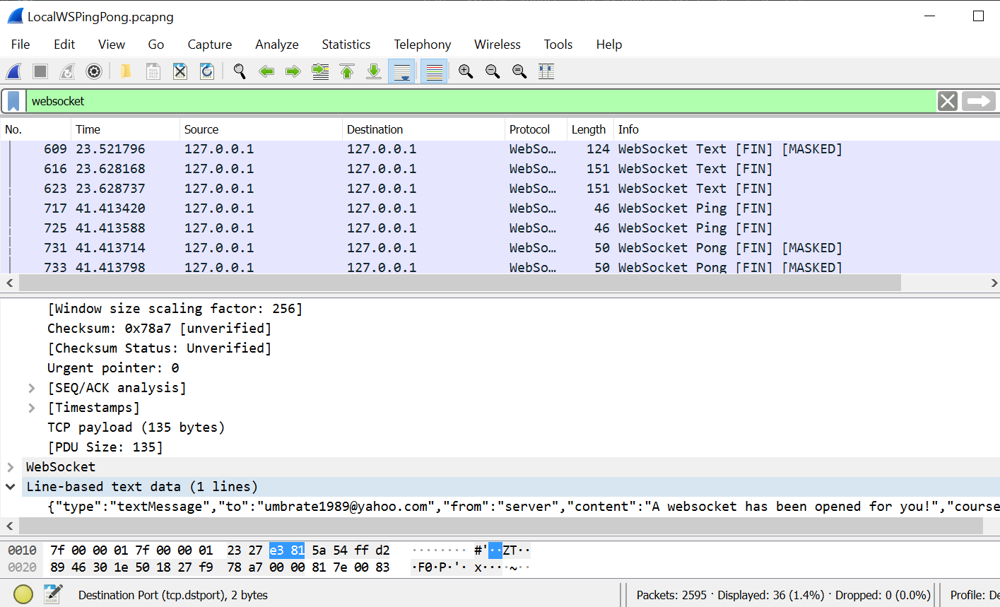
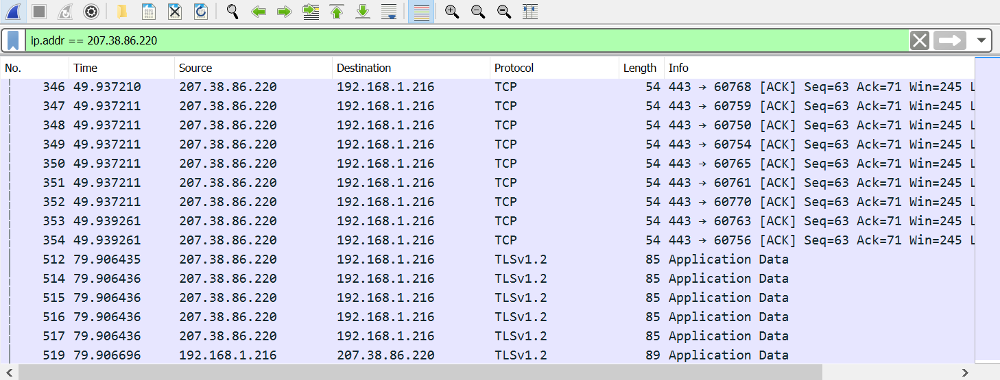

# Interactive Remote Web Classroom Notes

## Product Definition/Functionality

* How would this be different from current Zoom functionality? Try Zoom polling, whiteboard, and other features.

* How would this be different from current BB functionality? Realtime, Interactive!

* Example open source ARS system [Klicker^UZH:Open source instant audience response system](https://uzh-bf.github.io/klicker-uzh). Note that they don't directly use the `ws` library but use [subscriptions-transport-ws](https://www.npmjs.com/package/subscriptions-transport-ws) which is "A GraphQL WebSocket server and client to facilitate GraphQL queries, mutations and subscriptions over WebSocket."

* Laptop, tablet, and/or mobile? Since I'm teaching web development and this requires a desktop/laptop browser. Hence we can restrict the initial application.

* How much to keep on the server? One idea is to have the teacher (me) keep the various learning materials on my own computer and upload on demand through the server rather than storing stuff on the server. Why? Issues with BB and loading questions to server: All of the systems use a GUI which is slow an painful when one wants to make a number of variants of questions, etc... Computer science folks can use more natural approaches such as directories and files...

* Initial Applications: Polls, Multiple choice questions, short code or CSS questions. Gather (consolidate) student inputs.

## To-dos, Ideas, Issues

* Need a good name for the project at some point

* Dealing with multiple "projects" in a single repo. We have at least three main pieces: (1) server, (2) client app, (3) Special WebSockets testing app. Some large projects have used [Lerna](https://github.com/lerna/lerna#readme) to assist. Note the structure is similar to what we have started with, i.e., separate directories with their own package JSON and node_modules for the different major sub-pieces.

* Message formats and validation. Might as well use [JSON-schema](https://json-schema.org) to document and validate the messages.

* JSON based information used throughout. Work with Markdown as much as reasonable for writing questions/polls, and for student responses.

* Will need images for showing students questions. How to send and then incorporate into Markdown rendering process on the client? File handling and transfer DOM APIs? [Blob](https://developer.mozilla.org/en-US/docs/Web/API/Blob), [WebSocket send (client)](https://developer.mozilla.org/en-US/docs/Web/API/WebSocket/send) can send Blobs. [Using files from web applications](https://developer.mozilla.org/en-US/docs/Web/API/File/Using_files_from_web_applications)... Hmm it seems we will have to send multiple messages. One approach is to send (JSON) info message about the file(s) or message with markdown and info about the then send files.

* Hmm, putting images afterwards into HTML is possible [Using Object URLs](https://developer.mozilla.org/en-US/docs/Web/API/File/Using_files_from_web_applications#Example_Using_object_URLs_to_display_images)

* Sometimes seeing an unexplained delay/timeout on the WebSocket with Chrome. There seems to be some security thing that chrome does.

## Information

* [Wikipedia WebSockets](https://en.wikipedia.org/wiki/WebSocket). Good place to start for overview.

* [The WebSocket Protocol -- RFC6455](https://tools.ietf.org/html/rfc6455)

* [WebSockets and Express.js](https://medium.com/factory-mind/websocket-node-js-express-step-by-step-using-typescript-725114ad5fe4)

* [MDN The WebSocket API (WebSockets)](https://developer.mozilla.org/en-US/docs/Web/API/WebSockets_API)

* [MDN WebSocket](https://developer.mozilla.org/en-US/docs/Web/API/WebSocket)

* [MDN MessageEvent](https://developer.mozilla.org/en-US/docs/Web/API/MessageEvent)

* [MDN Writing WS Client Apps](https://developer.mozilla.org/en-US/docs/Web/API/WebSockets_API/Writing_WebSocket_client_applications)

* [MDN Writing WebSocket Servers](https://developer.mozilla.org/en-US/docs/Web/API/WebSockets_API/Writing_WebSocket_servers). Okay but not great.

[WebSockets for fun and profit](https://stackoverflow.blog/2019/12/18/websockets-for-fun-and-profit/)

[Web API design including WebSockets and such...](https://medium.com/platform-engineer/web-api-design-35df8167460)

## Software and Tools

[WS: a Node.js WebSocket library](https://www.npmjs.com/package/ws). This gets 23 Million downloads a week. Last update was 9 days ago. **Using** this.

* WebSocket Server (WSS) this is the server that handles *connections* (called WebSockets) to multiple clients.

* Smart WebSockets Client for Chrome extension.

* [express-ws](https://www.npmjs.com/package/express-ws) Integrates WS with Express in a more straightforward way. But how to get at advanced features such as client authentication? This is really poorly documented for this purpose. Hasn't been touched for two years. Will **NOT** use.

* UI library for React? There are a lot [20+ Best React UI Component Libraries / Frameworks for 2020](https://www.codeinwp.com/blog/react-ui-component-libraries-frameworks/), [11 React UI Component Libraries you Should Know in 2019](https://blog.bitsrc.io/11-react-component-libraries-you-should-know-178eb1dd6aa4), [23 Best React UI Component Libraries And Frameworks](https://hackernoon.com/23-best-react-ui-component-libraries-and-frameworks-250a81b2ac42)

* Need proxy for development. I've used [http-proxy-middleware](https://www.npmjs.com/package/http-proxy-middleware) with Parcel.js.

Configuration for [WebSockets](https://www.npmjs.com/package/http-proxy-middleware#websocket)

* A post about [WebSockets at WebFaction](https://community.webfaction.com/questions/19883/2016-way-to-create-a-websocket-app-with-nodejs)

Their configuration instructions:

1. Create a Node app via the control panel - this takes care of the Node install.

2. Create 'custom WebSockets app listening on port' application - this gets you the ability to do WebSockets.

3. Configure your Node app to listen on the port assigned to the WebSockets app (by editing index.js or whatever you're using to tell your app to listen on a port).

4. Configure your site in the control panel to use the WebSockets app instead of the node app. This will set up the configuration in our front-end web server so that your WebSocket requests will make it to your app.

Issues and solutions:

1. Ran into a bunch of 404 problems when I tried a very general proxy configuration, i.e., they proxy sent everything to the WebSockets server. So set up to forward a sub path "/myws" (for "my WebSocket").

2. Ran into issues with trying to send something before the WebSocket was open...

3. Very picky URL syntax. Fix this up and added an open listener.

## Use Cases

Will use *Admin* as short for *Admin/Teacher* when writing more details.

* Admin/Teacher Login
    1. Setting up admin password.
    2. Do we let admin login more than once?
    3. Logging admin logins

* Admin/Teacher Setup classroom session
    1. Real time setup, no scheduling
    2. One class at a time for now
    3. Admin specifies classroom name (will be used for keeping records along with start time) and a login password. Current classroom *name* is available via the GET `/course` path.
    4. Admin can **enable** and **disable** the classroom? What should this mean? 
        1. Stop new logins?
        2. Remove students from server?
        3. Stop student messages?
        4. Should this default to being *enabled* when the teacher sets the classroom name and password?
        5. Why would we need this? *Temporarily* stop student interactions, stop all logins if under attack, and allow us to remove and blacklist bad actors...
    5. Admin can **close** the classroom? What should this mean?
        1. Remove all student webSockets from server?
        2. Gather up all records for archiving?
        3. Remove classroom name and disable classroom?
        4. Why? This would be a more permanent action after a classroom session has ended and before starting a new session. Might want to require reauthorization for this since it could be very disruptive.
    6. Admin distributes password to students via a separate channel: Blackboard, Zoom, etc...

* Admin Class Status should get immediate feedback on attendees and such
    1. With larger classes don't want to send all the information with every update as currently being done.
    2. We currently index the userMap by the sessionId which is unique. Hence could use that to update client rather than sending entire list.
    3. Have a path like GET `/classroom` to get all attendees
    4. Have WebSocket messages to update admin (and students?) client about students joining and leaving classroom.

* Student Login to classroom
    1. Classroom session must already be established and *enabled* by Admin. We will show classroom name from server --GET `/course`-- and enabled status
    2. User logs in with name/identifier and classroom password
    3. We keep track of students so we can send them messages, and know who sent which messages, and also to suppress spam behavior.

* Markdown Message Sending (Should we do text message sending as a subset?)
    1. Markdown without images communications
    2. Admin to student, Admin to all students, Admin to groups?
    3. Students to Admin
    4. Students to Students (more advanced, may need to moderate)
    5. Messages are entered and sent in Markdown and rendered into HTML

* Simple Multiple Choice Question/Polling
    1. Question/Poll Authoring: Structured Markdown (HTML structuring elements containing Markdown)
    2. Question/Poll Student Display
    3. Question/Poll Student Response
    4. Response aggregation for Teacher (What should be done on the server)
    5. Response display for Teacher

* Images with Questions, Polls, and Messages?
    1. Best way to combine Markdown/HTML and images in messages? (see below)
    2. Want to keep authoring fairly simple
    3. Don't want to reinvent a transport protocol on top of WebSockets (see below)

* Message Types and Formats
    1. JSON all text
    2. JSON with [Base64](https://developer.mozilla.org/en-US/docs/Glossary/Base64) encoding for embedded images and such. Note JavaScript `btoa()` and `atob()` functions for doing this?
    3. JavaScript blob with fixed header followed by a variable length header, followed by a bunch of blobs for each item. This could work as well as (2). Info on JavaScript [blob](https://javascript.info/blob). A blob can have multiple parts but you need to know where to break them up.
    4. Note that for any multi-file format we would need to provide tooling/UI to prepare the files.

# Development, Build, and Deploy

Things to remember:

* If you add a new HTTP path to the server, you need to add that path to the devProxy!

## Different Builds for Different Situations

Deployment build of app:
`parcel build index.html --public-url ./`

1. Development Build/Server (Uses Proxy)
    * Replace contents of `configAddrPorts.json` with `configAddrPortsDev.json`
    * In `ClientApp` directory run `node devProxy.js`
    * In `Server` directory run `node serverStartLocal.js`

    ```javascript
    // From configAddrPortsDev.json
    {
    "clientWsURL": "ws://192.168.1.216:1234/myws",
    "wsPath": "/myws", // used by proxy
    "wsServer": "localhost", // used by server and proxy
    "wsPort": 8999, // used by server and proxy
    "devHost": "192.168.1.216", // used by proxy/dev-server
    "devPort": 1234 // used by proxy/dev-server
    }
    ```

2. Local Machine Deployment (Doesn't Use Proxy)
    * Replace contents of `configAddrPorts.json` with `configAddrPortsLocal.json`
    * In `ClientApp` directory run `parcel build index.html --public-url ./`
    * Replace contents of `Server/public` directory with `ClienApp/dist` directory contents (well only the most recent build items).
    * In `Server` directory run `node serverStartLocal.js`

    ```javascript
    // from configAddrPortsLocal.json
    {
    "clientWsURL": "ws://192.168.1.216:5555/myws",
    "wsServer": "192.168.1.216",
    "wsPort": 5555
    }
    ```

3. WebFaction Deployment (Doesn't use Proxy, but has special port and such)
    * Transfer Server code to WebFaction
    * Replace contents of `configAddrPorts.json` with `configAddrPortsGrotto.json`
    * In `ClientApp` directory run `parcel build index.html --public-url ./`
    * Replace contents of `**/public` directory of the server at WebFaction with `ClienApp/dist` directory contents (well only the most recent build items).
    * WebFaction Path setting: `export PATH=$PWD/bin:$PATH` then can use typical npm and node commands.
    * Note: Just do a normal `npm install` with the package.json file.

    ```javascript
    {
    "clientWsURL": "wss://classroom.grotto-networking.com/myws",
    "wsServer": "localhost", // we sit behind a proxy
    "wsPort": 21146 // Given by webfaction
    }
    ```

## Development Plan

Update: due to in person classes being cancelled, my first version will be aimed at WebFaction/HTTPS deployment.

Split: Into distinct client and server directories with separate `node_modules` and `package.json` for each.

Next we want to set up some basic login/registration functionality. Will assume server is running. Make login the first thing to be done after receiving application, prior to opening web socket.

Functionality:

1. Admin/Teacher user login
    1. Set in JSON file on admin/teacher machine
    2. Teacher uses it to login and get teacher screens and privileges.
    3. WebSocket will not be created until successful login

2. Admin/Teacher privileges
    1. Admin/Teacher can send content to student/members
    2. Admin/teacher can set per class student login password

3. Student/member login
    1. WebSocket will not be created until successful login
    2. Password will be given in person in class (per class session)

4. Security Issues
    1. There is no way around using HTTPS for security!
    2. Set up two simple Node.js programs to set and check admin name and password (and only keep hash).
    3. Will add login and logout functionality. Teacher will set a classroom/session based password for students. Login will happen prior to WebSocket establishment with server.
    4. After successful login App will automatically try to establish WebSocket.

# Client

1. Basic  Message Sending and Receiving
    1. React component to view the all messages **DONE**
    2. React Component to send a message. **DONE**
    3. Put in field for user to enter their name or id to send to the server.
    4. Want to show some stats to select users.

2. Components and Such
    1. Login component (also grants privileges)
    2. Message component to show messages received and for sending
    3. User info component to show messages about who is connected

# Server

## Initial Explorations

1. Establish mechanism for updating IP address without updating a bunch of files. **DONE**
2. Basic Message Echoing **DONE**
3. Send Message when new socket opens. **DONE**
4. Starting to retain information about attached clients. Updated proxy to forward original host information in a header.

## Refining/Defining Functionality

* How should we track/manage users?
* We only deal with a limited number of users at a time, i.e., a class
* When the class session is over we logout/disconnect the users from the server
  * Should provide an indication of what class is in session in the login window
  * Need to tell the difference between a dropped WebSocket connection (which should be reconnected) and the end of a class session.
* Don't let students login if there is no class in session
* Track all logged in students and their WebSocket connection
* Limits on number of logged in students in case we get hacked
* How can we force a "logout", i.e., destroy sessions for users when a class session ends? I think we get a hold of the "session store".
* Need a "real" session store. Trying: <https://www.npmjs.com/package/nedb-session-store.>

## Networking & WebSockets

* Detecting missing clients: [How to detect and close broken connections](https://www.npmjs.com/package/ws#how-to-detect-and-close-broken-connections)

* Will the above help with the timeouts we are seeing on deployment?

* What about from the client side?

Debugging tips: Wireshark can now look at the loopback interfaces on Windows machines as well as Linux. It also has a WebSocket filter so I was able to watch traffic between local client and server. This is useful since *ping* and *pong* WS messages do not show up in browser network panel. See the screenshot below.



Note that this is even more important since with the external server with HTTPS and WSS we can't see anything in the packets as shown below:



## Testing the Server

* How can we create and control multiple clients for test purposes?
* Node.js supports multiple processes. However, we **DON'T** need multiple processes to have multiple clients!!! See `multiClientTest.js` code for how to do this!
* Node.js low level [process stuff](https://jscomplete.com/learn/node-beyond-basics/child-processes)
* Node.js [cluster API](https://nodejs.org/dist/latest-v12.x/docs/api/cluster.html) is really for sharing/distributing a TCP/HTTP connection amongst multiple worker processes.
* Better article on [cluster API](https://medium.com/js-imaginea/clustering-inter-process-communication-ipc-in-node-js-748f981214e9).
* The [Process API](https://nodejs.org/dist/latest-v12.x/docs/api/process.html) has the send message and on message stuff in it for IPC.
* One approach would be to use "request-promise-native" and the client part of "ws" under control of a cluster manager...

### Initial Steps

Come up with a single code based client that can

* login to server
* upgrade to a WebSocket connection
* Send a message
* Console log received messages

**Success!**

### Simplest ClI testing

Can we talk to a Node.js program via the command line and have it receive stuff from the network? **YES** Used the Node.js `readline` interface with their mini-CLI example.

More advance interactive menus see [inquirer](https://www.npmjs.com/package/inquirer)

### Basic Test Scenario

Start Server

1. Login as admin user and set classroom password
2. After (1) has completed set up a series of student users with a set delay between each one.
3. Have users send some messages.

### Automating Testing

A bunch of testing involves the sending of WebSocket messages between users/admin. How can we automate this with a framework such as Mocha or Jest?

Issues: Starting and shutting down server by test code is a bit of a pain. Initial tests will assume server is started separately and will check for it.

Added the `.mocharc.json` file to point to the mocha test subdirectory with the general ServerTesting directory. With this file the test runner extension to VSC could then find the tests.

#### Message Forwarding Type Tests

1. Need to start Server -- *test setup*
2. Need to set up admin and client WebSockets via proper login procedures *test setup*
3. Need to run some type of communications test, i.e., some user sends a message to some other user(s). How do we get the result?
4. Or run some type of test that triggers a status update such as adding or removing a user.

A status change message is generated by some

# Messages and APIs

Here we look at what information should be available/settable via HTTP APIs, and what should be sent via web sockets.

Basic guidance: 

1. Anything that needs to be pushed to students in real time needs to be via WebSockets.

2. Classroom configuration and control by admin via HTTP

3. Login and Logout via HTTP

## WebSocket Messages

### Current message formats

These were just put together for quick de-risking of the system.

This is the message used to update the status of which users are currently in the "classroom":

```javascript
{
    type: "statusMessage",
    to: "you",
    from: "server",
    content: Array.from(userMap.values()),
  }
  ```

Message sent by server when the WebSocket has been established:

```javascript
{
    type: "textMessage",
    to: userInfo.name,
    from: "server",
    content: "A websocket has been opened for you!",
    course: classroomInfo.course,
  }
```

This is the message sent by the React client right after the WebSocket is successfully opened on the client:

```javascript
{
    type: "textMessage",
    to: "all",
    content: "Hello Websockets from React!"
}
```

### Requirements and Message Types

Good or required information to have in a general message:

* Message ***type*** since we have different types of messages that need to be processed differently. Hmm, if the content portion of the message is "self describing", i.e., has its own type information, then this would be more to indicate which subsystem on client or server should process the message. 
* Source and Destination **to** and **from**
* ***content***! Hmm, should this be self describing in some sense. By having this describe itself in some way we may not need as many message types and subtypes... Looking at JSON-Schema for ideas... See the [section on combining schemas](https://json-schema.org/understanding-json-schema/reference/combining.html) and [conditional stuff](https://json-schema.org/understanding-json-schema/reference/conditionals.html)
* version: usually always recommended in all protocols.
* Time stamp: Why? Allows for easy sorting of messages by time.
* id: Do we need a general message id or is this only needed for certain types of messages such as a question that will have a corresponding answer? Will wait on this.

Message categories/types

* Status Messages
    1. Change in course, i.e., enabled, disabled, closed
    2. Update to participants

* General Chat (1-1, 1 to all)
    1. text?
    2. Markdown no images
    3. Markdown with images

* Teacher to Student and Response
    1. Question (multiple choice, short answer, general answer) no images, with images. How would this be different than chat messages? Would it include portion that dictates a structure for the response?
    2. Poll. How is this different from a question?
    3. Response messages from students

Want to have good validation. What can JSON-Schema due with "variants", i.e., content could be of different types...

See file `classroomSchema.json` for a start.

Message types (not by content): Status, Chat, Question, Answer
Content types: JSON data, text, Markdown, Markdown with images

Sample data:

```javascript
{
    "type": "textMessage",
    "version": 1,
    "datetime" : "2020-06-04T19:26:17.396Z",
    "from": "me",
    "to": "you",
    "content": "hi all"
}
```

## HTTP(S) APIs

Currently:

* "/" to get the React App
* `/login` and `/logout`
* `/course` to get info about the "course" (need a better name)
* `/setCourse` Used to set course name and password. Needs to be fixed as it is not REST and we have more parameters that we may want to set.